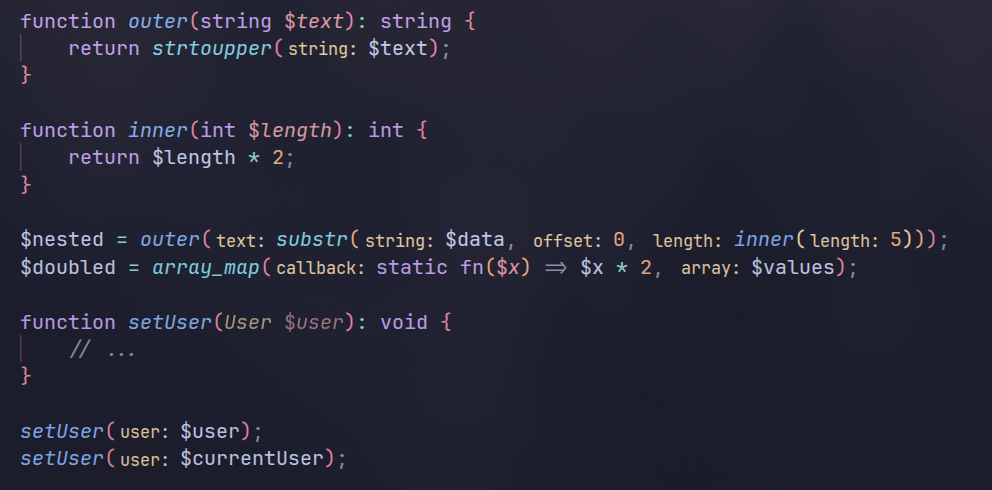

# PHP Type Hints

Display parameter names and return types as inlay hints for PHP.

## Features

- **Parameter Hints**: Shows parameter names before arguments in function and method calls
- **Return Type Hints**: Displays inferred return types for functions without explicit type declarations
- **Smart Detection**: Automatically hides hints for named arguments (PHP 8.0+)
- **Configurable**: Hide hints when variable names match parameter names
- **LSP-Powered**: Leverages Language Server Protocol for accurate type information

## Screenshot



## Requirements

- [Intelephense](https://marketplace.visualstudio.com/items?itemName=bmewburn.vscode-intelephense-client) extension
    must be installed and active

## Configuration

```jsonc
{
    // Enable or disable all type hints
    "phpTypeHints.enabled": true,

    // Show parameter name hints for function calls
    "phpTypeHints.showParameterHints": true,

    // Show return type hints for function declarations
    "phpTypeHints.showReturnTypeHints": true,

    // Hide hint when variable name matches parameter name
    "phpTypeHints.hideWhenArgumentMatchesName": true,

    // Maximum file size to process (in bytes)
    "phpTypeHints.maxFileSize": 100000
}
```

## Commands

- **PHP Type Hints: Toggle Hints** - Quickly enable/disable all hints

## Development

### Install Dependencies

```bash
npm install
```

### Compile

```bash
npm run compile
```

### Run Tests

```bash
npm test
```

### Create VSIX Package

```bash
npm run package
```

## License

[MIT License](LICENSE)

## Alternatives

- [PhpStorm Parameter Hints in VScode](https://marketplace.visualstudio.com/items?itemName=MrChetan.phpstorm-parameter-hints-in-vscode)
